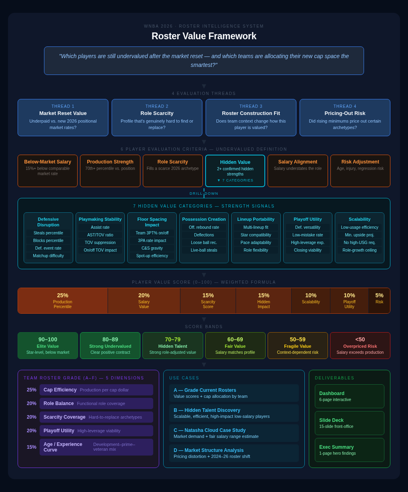

# 👋 Cheers, I'm Krystal — Sports Analyst. Storyteller. Stat Decoder.

Women’s basketball analytics builder focused on player evaluation, scouting profiles, roster strategy, media stat packets, and data storytelling for emerging and developmental women's leagues by building data-driven and decision-ready tools for lean sports organizations.

 

## 🏀 How I Can Support a Developmental League

- Player performance reports and scouting profiles
- Team and opponent prep dashboards
- Combine/Tryout evaluation tools
- Roster and player development tracking
- Draft/pro-placement player summaries, historical & current
- Broadcast/media stat packets and player storylines
- League storytelling custom data visuals for front office, social, and fan engagement
 

## 🧠 Player & Roster Intel Framework

A lightweight analytics framework for developmental women’s basketball leagues — connecting player evaluation, roster tracking, scouting profiles, media packets, and league storytelling into one repeatable workflow.

  

## 📊 Featured Basketball Analytics Projects

| Project | Use Case | Output |
|---|---|---|
| [Development Report: Lulu Twidale (Cal)](https://kbsmd-sportsmusicdata.github.io/wbb-player-development-report/), WBB 2023-24 thru 2025-26| Player evaluation + development analysis, prospect/pathway analysis, decision-support analytics | Interactive notebook + player cards · [Project Brief](https://github.com/kbsmd-sportsmusicdata/wbb-player-development-report/blob/bde62d20c1708458b9c03e454cbc7dcc050452e8/docs/executive_summary.md) · [Repo](https://github.com/kbsmd-sportsmusicdata/wbb-player-development-report)|
| [Player Intelligence Dashboard](https://kbsmd-sportsmusicdata.github.io/wbb-player-intel-dashboard/), WBB 2025-26 | Player evaluation + development | Interactive dashboard · [Project Brief](https://github.com/kbsmd-sportsmusicdata/wbb-player-intel-dashboard/blob/main/docs/executive_summary.md) · [Repo](https://github.com/kbsmd-sportsmusicdata/wbb-player-intel-dashboard) |
| [Hidden Value Player Contract Analysis](https://kbsmd-sportsmusicdata.github.io/hidden-value-contract-analysis/), WNBA 2024-2026 | On/off contextual player impact + comps salary, decision-support analytics | Notebook + charts · [Project Brief](https://github.com/kbsmd-sportsmusicdata/hidden-value-contract-analysis/blob/11b76af7225879bb4ffcb26b9785097c0f38e77d/docs/executive_summary.md) · [Repo](<https://github.com/kbsmd-sportsmusicdata/hidden-value-contract-analysis>) |
| Roster Value Framework, WNBA 2026 | Roster construction + hidden value context | Notebook + charts |
| AP Polls Pipeline, WBB 2025-26 | Automated reporting, current + historical AP Polls data | Python pipeline + data outputs |
| Recruiting + Development Impact, WBB | Prospect/pathway analysis, decision-support analytics | Dashboard + model outputs |
| [NCAA D1 Women's Sports Demographics Deep Dive](https://github.com/kbsmd-sportsmusicdata/ncaa-d1-demographics-coaching-pipeline) (2012-2025)| League infrastructure analytics | Interactive notebook HTML, features 🏀🥎⚽🏐 | 
 

## 💡 Current Focus

Looking for new opportunities in basketball analytics. Building portfolio-ready women’s basketball analytics tools that translate raw data into scouting, player development, roster planning, and storytelling decisions. I’m passionate about **elevating women’s sports** through engaging data storytelling and deeper data. I believe that statistics shouldn’t be gatekept — they should **bring people closer to the game**.

 

## 🛠️ Tools & Skills

- **Languages & Libraries**: Python (Pandas, NumPy, Scikit-learn), SQL, BigQuery, Google Sheets, Excel
- **Data Viz & Dashboards**: Tableau Public, Looker Studio
- **Workflow & Storytelling**: GitHub, Notion, Figma, AI tools
- **Key Strengths**: Data Cleaning • Basketball Analysis • Interpreting Contextual Player Impact • Data Visualization • Building Dashboards • Sports Predictive Modeling • Sports Statistics Models • Communicating Data Insights • Editorial Data Stories

 

## 🔍  Let's Connect
Ready to help women’s basketball organizations build their analytics infrastructure.

📬 **Email**: hey@krystalbcreative.com  
**LinkedIn**: https://www.linkedin.com/in/krystalbeasley/  

---
> “A lot of people notice when you succeed, but they don't see what it takes to get there."  -  Dawn Staley

<!---
kbsmd-sportsmusicdata/kbsmd-sportsmusicdata is a ✨ special ✨ repository because its `README.md` (this file) appears on your GitHub profile.
You can click the Preview link to take a look at your changes.
--->
